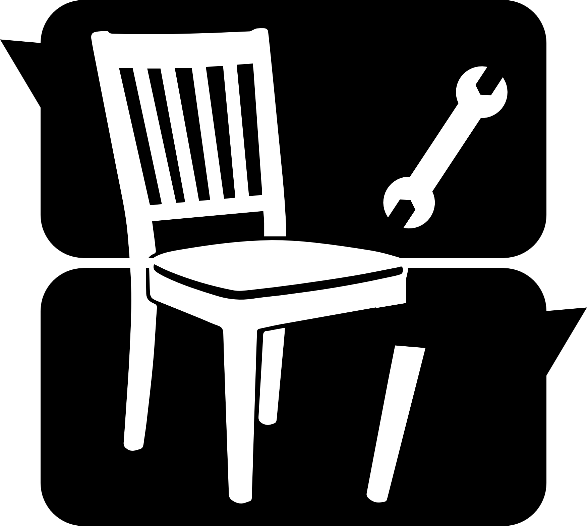

# 🛠️ 組みTalk (Kumi-Talk)

**家具の“取説”をチャットで解決する AI アシスタント**

だれでも迷わず組み立てられる“会話型マニュアル体験”を提供します。
PDFの取説をアップロードすると、工程や部品の疑問に根拠つきで答えます。



## 🏆 概要 / 位置づけ

* **ハッカソン提出想定のMVP**（2日開発）
* **会話×根拠引用**でDIY初心者にもやさしい操作性

## ✨ プロジェクトの特徴

### 💬 コア機能

* **PDFアップロード**: 取説（PDF）とメタ情報を登録
* **自動解析 & RAG**: ページ分割→埋め込み→近傍検索→**回答**
* **チャットQA**: 途中からでも再開できる履歴ベースの対話
* **横断検索**: 取説を跨いだ検索・再開

### 🔧 技術的アピールポイント

#### モダンスタック

* **Next.js 14 (App Router)** + **TypeScript**
* **Supabase**（Auth / Postgres / Storage / RLS）
* **pgvector** によるベクトル検索
* **Tailwind CSS** による迅速なUI開発
* **LLM**: Gemini

#### アーキテクチャ設計

* **非同期解析ジョブ**: 初回解析はバックグラウンドで進行、UIはプログレス表示
* **RLS/権限制御**: 所有者だけが`documents`と索引（`document_chunks`）へアクセス
* **引用UI**: 回答の根拠ページへジャンプ

## 🏗️ システム構成

```
Frontend (Next.js)
    ↓ API Routes (/app/api/*)
Backend (Upload / Analyze / Chat)
    ↓
Supabase (Auth / Postgres / Storage / pgvector / RLS)
    ↓
LLM Provider (Gemini via Adapter)
```

## 🚀 環境構築

### 必要な環境

* Node.js 20+
* Supabase CLI（ローカルDB / pgvector）

### セットアップ手順

1. **リポジトリのクローン**

```bash
git clone <your-repo-url>
cd kumi-talk
```

2. **依存関係のインストール**

```bash
npm install
```

3. **環境変数の設定**（`.env.local` 例）

```bash
NEXT_PUBLIC_SUPABASE_URL="..."
NEXT_PUBLIC_SUPABASE_ANON_KEY="..."
SUPABASE_SERVICE_ROLE_KEY="..."
LLM_PROVIDER="gemini"
GEMINI_API_KEY="..."
```

4. **データベースの起動/初期化**

```bash
supabase start
supabase db reset  # pgvector有効化 & 初期スキーマ投入
```

5. **開発サーバーの起動**

```bash
npm run dev
```

アプリは [http://localhost:3000](http://localhost:3000) で起動します。

## 🎯 主要機能（画面）

### ルーム/一覧・詳細に相当する導線

* **/**: ホーム（最近のチャット / アップロードCTA）
* **/chat/[id]**: チャット（引用から該当ページへジャンプ）

### 解析とチャットの体験

1. PDFをアップロード → `documents.status = processing`
2. 解析完了で`ready` → 「脚の向きが不安」など自然言語質問
3. 回答に**根拠引用**が付与 → クリックでページへスクロール

## 🔧 開発・運用コマンド

```bash
# 開発
npm run dev

# 本番ビルド/起動
npm run build
npm run start

# 品質
npm run lint
npm run format
npm run format:check
```

## 📈 技術的成果指標（想定）

* **初回解析**: 非同期実行、UIで段階プログレス表示
* **チャット応答**: p95 < 3s（近傍検索+LLM）
* **安全性**: RLSで**他人のドキュメント不可視**

## 📁 ディレクトリ構成（例）

```
kumi-talk/
├── ducuments/
│   └── chair_nitori.pdf
│   └── shelf_ikea.pdf
├── prisma/
│   └── migrations/
│   └── schema.prisma
├── public/
│   └── images/
│       └── kumi-talk.png
├── app/
│   └── api/
│       ├── upload/
│       ├── analyze-manual/
│       ├── messages/
│       └── documents/
├── src/
│   ├── api/
│   │   ├── (auth)/
│   │   ├── analyzer/
│   │   ├── api/
│   │   ├── chat/
│   │   ├── favicon.ico
│   │   ├── globals.css
│   │   ├── layout.tsx
│   │   ├── page.tsx
│   ├── components/
│   │   ├── chat/
│   │   ├── dialog/
│   │   ├── manual-analyzer/
│   │   ├── ui/
│   │   ├── global-progress-overlay.tsx
│   │   ├── top-nav.tsx
│   │   ├── top-progress.tsx
│   ├── lib/
│   │   ├── auth.ts
│   │   ├── prisma.ts
│   │   ├── progress.tsx
│   │   ├── utils.ts
├── package.json
└── README.md
```
---

**開発期間**: 2日 (ハッカソン)
**チーム構成**: フルスタック
**デプロイ**: Vercel + Supabase

本READMEは、既存制作物READMEの**トーンと段構成**に揃えています。必要に応じて、バッジ・受賞歴・スクリーンショット差し替え等を追加してください。
