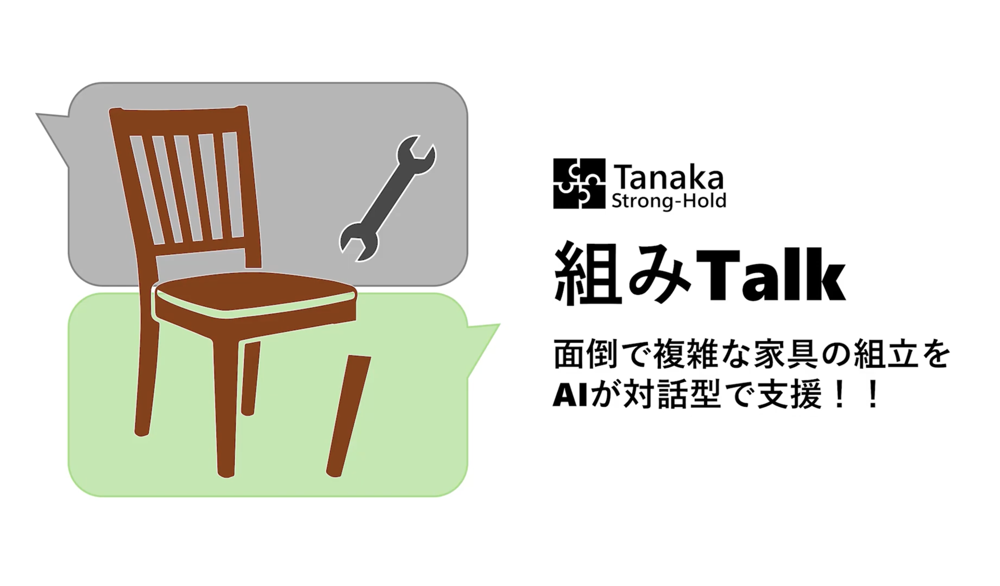
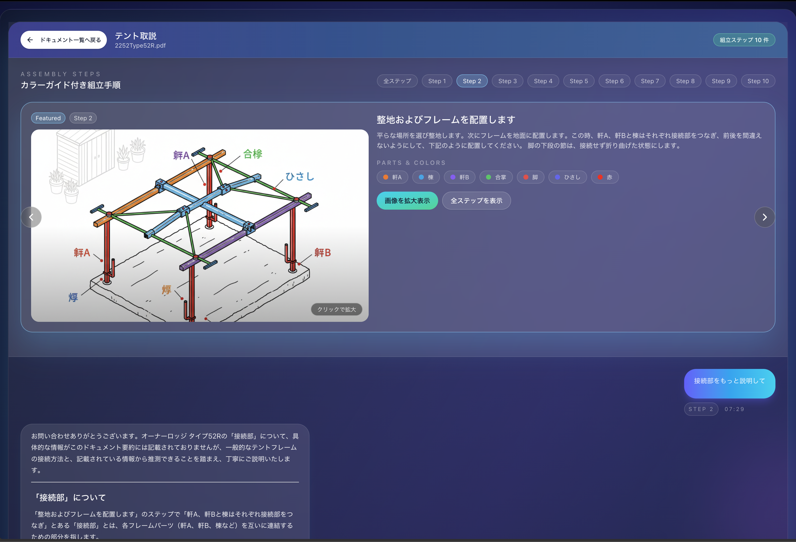
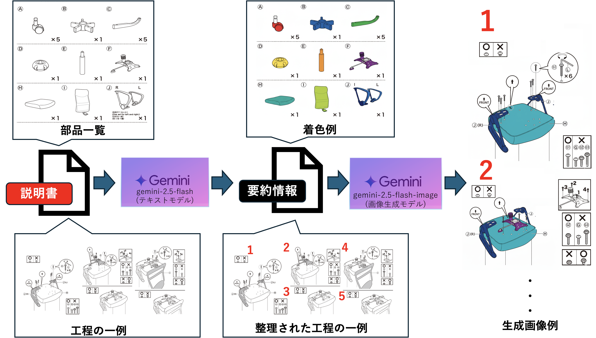

# 組みTalk (Kumi-Talk)

**家具の“取説”をチャットで解決する AI アシスタント**

だれでも迷わず組み立てられる“会話型マニュアル体験”を提供します。
PDFの取説をアップロードすると、工程や部品の疑問に根拠つきで答えます。

## 各種リンク
 - サイトURL：https://kumi-talk-tanakastronghold.vercel.app
 - デモ動画URL：https://youtu.be/QWwfHjx5484

## 製品概要

取説 x Tech：面倒な家具の組み立てをAIが対話型で支援するWebアプリ

## 背景

### 家具の組み立てに関する課題

新しい家具を購入したとき、多くの人が組み立て作業に苦労しています。

#### ユーザーが直面する問題
- **説明書がわかりにくい**：文字や図面が多く、どこから読めばいいのか迷ってしまう
- **専門用語や複雑な表現**：「ダボ」「六角レンチ」など、普段使わない用語が並び、理解に時間がかかる
- **視覚的な情報不足**：平面図だけでは立体的な組み立て手順がイメージしにくい
- **どの部品をどの順番で使うのかわからない**：似たようなネジやパーツが多く、間違えやすい
- **途中で詰まっても質問できない**：説明書は一方通行で、疑問点をその場で解決できない

#### 企業が抱える課題
これらのユーザーの困りごとは、企業にとっても大きな課題となっています。

- **問い合わせ対応コストの増加**：組み立て方法に関する電話やメールでの問い合わせが多く、カスタマーサポートの負担が大きい
- **顧客満足度の低下**：組み立ての難しさがネガティブなレビューにつながり、ブランドイメージに影響する
- **返品・クレームの発生**：誤った組み立てによる破損や、「組み立てられない」という理由での返品が発生
- **購入障壁の存在**：「組み立てが面倒そう」という理由で購入を躊躇する潜在顧客の損失

### 本製品による解決

本製品は、AIとの対話を通じてこれらの課題を解決します。ユーザーは誰でも簡単にストレスなく**家具を組み立てられる**ようになり、企業は**ユーザー体験の向上**を実現できます。

## 製品説明(具体的な製品の説明)

取説のPDFをアップロードするだけで、手順ごとの画像と説明が組み立てステップごとに出力されます。
さらに、ステップごとに生成AIへのチャットが可能であり、丁寧に質問に答えてくれます。

#### 1. PDF読み込み
家具の取扱説明書（PDF）をアップロードするだけで準備完了。ドラッグ&ドロップで簡単に読み込めます。

#### 2. 組み立て手順と部品解析
AIが説明書を自動解析し、複雑な手順をわかりやすいステップに分解。各手順で必要な部品やツールを明示し、効率的な組み立てをガイドします。

#### 3. AI画像生成
各手順に必要な部品を色分けした画像を自動生成。どの部品をどこに使うのかが一目でわかり、視覚的に理解できます。

#### 4. 対話型チャット機能
各手順ごとにAIとチャットが可能。「このネジはどれ？」「ここがうまくいかない」など、疑問点をその場で解決できます。ユーザーに寄り添った対話で、安心して組み立てを進められます。

## 解決できること

#### ・わかりやすい手順案内
複雑な説明書をAIが自動解析し、理解しやすいステップに分解。どこから読めばいいのか迷うことなく、スムーズに組み立てを進められます。

#### ・専門用語を平易な言葉に
「ダボ」「六角レンチ」などの専門用語を自動で検出し、誰でも理解できる表現に変換。難しい言葉で悩む時間を削減します。

#### ・色分け画像で視覚的に理解
各手順で使う部品を色分けした立体的な画像を自動生成。平面図では分かりにくかった組み立て方が、一目で直感的に理解できます。

#### ・部品と手順を明確に表示
似たようなネジやパーツを間違えることなく、各手順で必要な部品を明示。正確な組み立てをサポートします。

#### ・いつでも質問できる安心感
対話型チャット機能で、疑問点をその場で即座に解決。24時間365日、AIがあなたに寄り添ってサポートします。

## 今後の展望

現在は画像の色分け、ステップごとの説明、対話型チャット機能を提供していますが、今後はさらなる進化を目指します。

### ・動画生成機能
組み立て手順を動画として自動生成し、より直感的な理解を促進します。動きのある説明で、複雑な工程も一目で把握できるようになります。

### ・3Dモデルによる360度可視化
各ステップを3Dモデルで表示し、360度あらゆる角度から確認可能に。部品の取り付け位置や向きを立体的に理解できます。

### ・XR（拡張現実）技術の活用
AR/VR技術を活用し、実際の家具に重ねて組み立て手順を表示。ユーザーがより直感的に、実物を見ながら組み立てられる体験を提供します。

## 注力したこと（こだわり等）

### 1. 部品の色分けの一貫性
各手順間で同じ部品には必ず同じ色を割り当てることにこだわりました。

**狙い：**
- ユーザーが手順を進める中で、「この青い部品は前の手順でも使ったネジだ」と直感的に認識できる
- 色による視覚的な記憶により、部品の混同を防ぎ、組み立てミスを削減

**技術的な実装：**
PDFから抽出した部品情報に基づき、初回登場時に色を割り当て、以降の手順でも同じ色を維持するロジックを構築しました。

### 2. 手順ごとのコンテキストに基づいたチャット機能
各手順の画像と要約を事前に生成し、その情報をもとにAIとのチャットを可能にしました。

**狙い：**
- ユーザーが「このネジはどれ？」と質問した際、現在の手順で使用する部品を正確に回答できる
- 前後の手順情報も踏まえた、文脈に沿った対話体験の実現

**技術的な実装：**
各手順の画像、部品リスト、説明文を構造化データとして保持し、チャット時にAIがその情報を参照できるようにしました。これにより、「今のステップ」に特化した対話が可能になっています。

## 独自技術

PDFをそのまま、生成AIに適用させるだけでは、思った通りの出力になりませんでした。
そこで、私達は以下のフローを適用しました。

### Step 1: PDF解析
**使用モデル：Gemini 2.5-flash（テキストモデル）**

説明書のPDFから、部品一覧と組み立て手順を自動認識。各ステップで使用する部品を特定し、構造化データとして抽出します。

### Step 2: 部品への色割り当て
抽出した各部品に固有の色を自動で割り当て。**全手順を通じて同じ部品には必ず同じ色を適用**することで、ユーザーが視覚的に部品を追跡できるようにします。

### Step 3: 色分け画像生成
**使用モデル：Gemini 2.5-flash-image（画像生成モデル）**

PDFの組み立て図と手順情報をもとに、部品ごとに色分けされた分かりやすい3D風画像を生成。各ステップで使用する部品が一目で分かります。

### Step 4: 出力とチャット機能
生成された画像と説明文を各ステップに表示。ステップのコンテキスト情報をAIが理解し、「このネジはどれ？」などの質問に的確に回答します。

**チームメンバー**: 今村賢人，江畑尚，大屋善彦，笹原悠太

